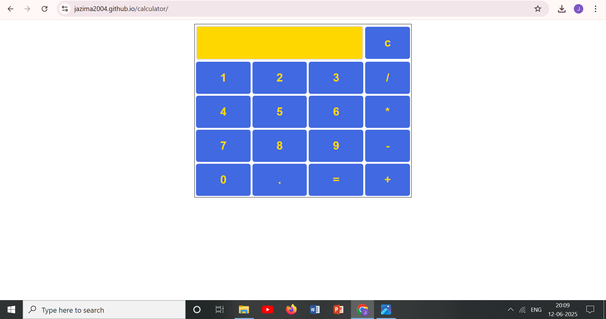

## applink: https://jazima2004.github.io/calculator/
## Simple calculator

This is a simple JavaScript-based calculator web application that allows users to perform basic arithmetic calculations. The app includes a graphical user interface (GUI) where users can interact with the calculator using buttons for digits, operators, and functions. The core logic is built using HTML, CSS, and JavaScript, and the Math.js library is used for performing the calculations.

